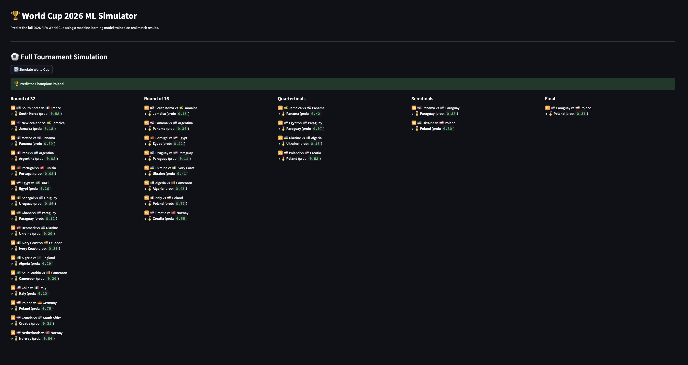

# World Cup 2026 Machine Learning Simulator




This project uses a machine learning model to simulate the full 2026 FIFA World Cup tournament, from group stage to final, based on real historical match data. It includes a full pipeline: data preprocessing, model training, simulation logic, and an interactive interface built with Streamlit.

---

## Features

- Predicts outcomes using a Random Forest model trained on real match results
- Simulates the full 48-team World Cup format (12 groups of 4)
- Group stage standings and automated knockout bracket generation
- Probabilistic match outcomes based on model-predicted win probabilities
- Interactive Streamlit interface for single-click tournament simulation

---

## Technologies

- Python 3.10+
- scikit-learn
- pandas
- Streamlit
- joblib

---

## Project Structure

world-cup-predictor/
│
├── data/
│ └── processed/
│ └── cleaned_matches_extended.csv # Match data (real + augmented)
│
├── src/
│ ├── app.py # Streamlit UI
│ ├── train_model.py # Model training script
│ ├── simulator.py # Knockout stage simulation logic
│ ├── group_simulator.py # Group stage simulation logic
│ ├── build_knockout.py # Converts qualified teams into a bracket
│ ├── model.pkl # Trained ML model
│ └── label_encoder.pkl # Label encoder for team names
│
├── README.md
└── requirements.txt


---

## Running the Project

1. Clone the repository:

```bash
git clone https://github.com/your-username/world-cup-2026-predictor.git
cd world-cup-2026-predictor
